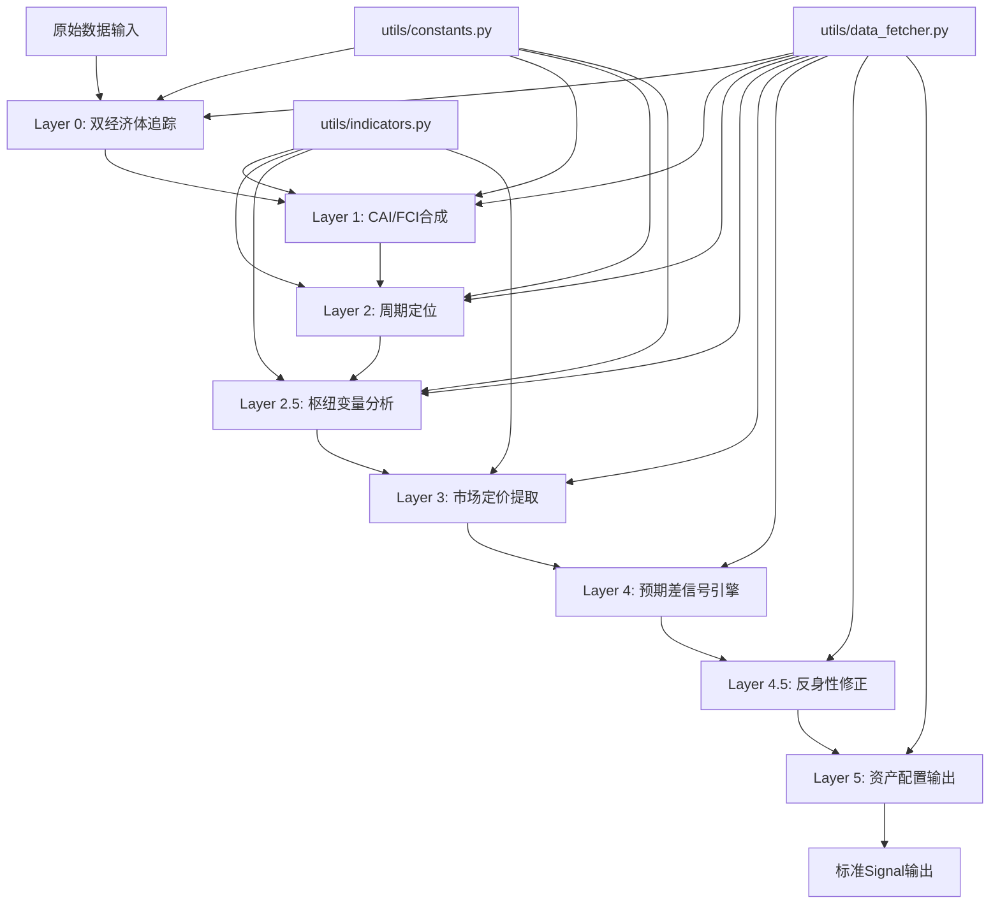

## 产品概述

实现宏观分析Skill（7层流水线），基于五大底层公理，从双经济体追踪、状态识别、周期定位、枢纽变量分析、市场定价提取、预期差信号引擎、反身性与元认知修正，到最终的Beta+Alpha资产配置，构建从宏观状态识别到资产配置的完整信号生产线。

## 核心功能

1. **Layer 0 - 双经济体追踪与中美交互通道**：并行追踪中美五大维度指标，识别6条传导通道的触发状态
2. **Layer 1 - 状态识别（CAI/FCI合成指标）**：将多指标合成为可跨期可比的标准化分数
3. **Layer 2 - 周期定位**：4象限 + 政策维度 + 长期债务周期定位
4. **Layer 2.5 - 枢纽变量分析**：汇率与大宗商品传导作用建模
5. **Layer 3 - 市场定价提取**：从市场价格反推市场已定价内容
6. **Layer 4 - 预期差信号引擎**：计算"实际状态vs市场定价"偏差，生成可执行信号
7. **Layer 4.5 - 反身性与元认知层（V3.1新增）**：监测共识拥挤程度和框架范式稳定性
8. **Layer 5 - 资产配置与权重输出**：将信号转化为可执行的投资组合权重

## 实施原则

- 按层拆分为多个子Skill（layer0_tracking、layer1_cai_fci等）
- 每个子Skill包含SKILL.md（分析规则）+ Python执行代码（scripts/目录）
- 预留单元测试和集成测试接口与结构，暂不实现具体测试用例
- 数据获取通过data_sources/统一调用（需确认或补充宏观数据接口）

## 数据说明

- **必填输入**：全球顶层约束、美国增长/通胀/流动性/市场定价、中国增长/信用/通胀/政策/流动性/市场定价
- **可选输入**：高频补充指标、另类指标、政策文本、预期差与意外指数、反身性与元认知指标
- **输出规范**：标准JSON格式，顶层字段与`agents.signal.Signal`对齐

## 技术栈选择

- **开发语言**：Python 3.10+
- **核心依赖**：dataclasses（Signal格式）、pandas（数据处理）、numpy（数值计算）
- **数据获取**：调用`data_sources/`封装的接口（需确认宏观数据接口实现状态）
- **测试框架**：pytest（仅预留结构）

## 实施方案

### 核心策略

采用**按层拆分 + 工具模块共享**的架构：

1. **8个独立子Skill**：每个Layer对应一个子Skill，包含SKILL.md + Python执行代码
2. **共享工具模块**：`utils/`目录存放数据获取、指标计算、常量定义
3. **标准输出格式**：所有Layer输出统一为`Signal`或`SignalBundle`格式
4. **流水线编排**：通过`pipeline.py`串联各Layer执行

### 关键决策

1. **数据获取方式**：创建`skills/macro/utils/data_fetcher.py`作为数据获取封装层，调用`data_sources/`接口。根据探索结果，`data_sources/akshare.py`目前没有宏观数据接口（PMI、CPI、社融等），需要在计划中说明此问题
2. **Layer解耦设计**：每个Layer独立可执行，前一层输出作为后一层输入，通过字典传递中间结果
3. **配置驱动**：权重表、阈值、评分规则等通过配置文件管理，便于回测校准

### 性能考虑

- 数据获取层增加缓存机制（避免重复请求）
- 指标计算使用pandas向量化操作
- z-score计算使用滚动窗口，避免全量重算

## 实施注意事项

### 数据获取层现状

**重要发现**：根据代码探索，`data_sources/akshare.py`主要实现个股和板块资金流向，**没有宏观数据接口**（PMI、CPI、社融等）。

**建议方案**：

1. 方案A：请求开发3组配合，在`data_sources/`中新增`macro_indicators.py`实现宏观数据获取
2. 方案B：在`skills/macro/utils/data_fetcher.py`中先封装宏观数据获取逻辑，作为临时方案

### 性能优化

- 数据获取增加缓存（避免重复请求相同数据）
- 使用pandas向量化计算替代循环
- z-score使用滚动窗口计算

### 降级控制

- 数据源失败时自动切换备用源
- 部分指标缺失时降级处理（标注uncertainties）
- 整个Layer失败时输出neutral信号

## 架构设计

### 系统架构图



### 数据流

原始数据 → data_fetcher → Layer 0-5依次处理 → Signal输出

## 目录结构

### 目录结构说明

本实现为现有项目新增macro skill功能。按层拆分为8个子Skill，共享工具模块，预留测试结构。

```
skills/macro/
├── README.md                           # [NEW] Macro skill总入口说明，描述7层流水线架构
├── utils/                             # [NEW] 共享工具模块
│   ├── __init__.py                    # [NEW] 模块初始化
│   ├── data_fetcher.py                # [NEW] 数据获取封装层，调用data_sources/接口
│   ├── indicators.py                  # [NEW] 通用指标计算（z-score、CAI、FCI、ERP等）
│   ├── constants.py                   # [NEW] 权重表、阈值、常量定义
│   └── signal_utils.py               # [NEW] Signal构建工具函数
├── layer0_tracking/                   # [NEW] Layer 0：双经济体追踪
│   ├── SKILL.md                      # [NEW] 分析规则文档（按ANALYSIS_SKILL_TEMPLATE.md格式）
│   └── scripts/
│       ├── __init__.py               # [NEW] 模块初始化
│       └── analyzer.py               # [NEW] Layer 0分析执行代码
├── layer1_cai_fci/                   # [NEW] Layer 1：状态识别（CAI/FCI）
│   ├── SKILL.md                      # [NEW] 分析规则文档
│   └── scripts/
│       ├── __init__.py
│       └── analyzer.py               # [NEW] CAI/FCI计算代码
├── layer2_cycle_positioning/          # [NEW] Layer 2：周期定位
│   ├── SKILL.md
│   └── scripts/
│       ├── __init__.py
│       └── analyzer.py               # [NEW] 4象限定位、政策维度调节
├── layer2_5_hub_variable/            # [NEW] Layer 2.5：枢纽变量分析
│   ├── SKILL.md
│   └── scripts/
│       ├── __init__.py
│       └── analyzer.py               # [NEW] 汇率分析、商品信号、三角定位
├── layer3_market_pricing/            # [NEW] Layer 3：市场定价提取
│   ├── SKILL.md
│   └── scripts/
│       ├── __init__.py
│       └── analyzer.py               # [NEW] 从市场价格反推预期
├── layer4_expected_diff/             # [NEW] Layer 4：预期差信号引擎
│   ├── SKILL.md
│   └── scripts/
│       ├── __init__.py
│       └── analyzer.py               # [NEW] 预期差计算、信号强度评分
├── layer4_5_reflexivity/            # [NEW] Layer 4.5：反身性与元认知（V3.1新增）
│   ├── SKILL.md
│   └── scripts/
│       ├── __init__.py
│       └── analyzer.py               # [NEW] 反身性压力计、范式稳定性监测
├── layer5_asset_allocation/          # [NEW] Layer 5：资产配置与权重输出
│   ├── SKILL.md
│   └── scripts/
│       ├── __init__.py
│       └── analyzer.py               # [NEW] Beta基准、Alpha偏离、风险预算约束
└── pipeline.py                       # [NEW] 流水线编排脚本，串联Layer 0-5

tests/macro/                              # [NEW] 测试目录（仅预留结构）
├── __init__.py                           # [NEW] 测试模块初始化
├── test_data_fetcher.py                  # [NEW] 数据获取测试（占位符）
├── test_indicators.py                    # [NEW] 指标计算测试（占位符）
├── test_layer0_tracking.py               # [NEW] Layer 0测试（占位符）
├── test_layer1_cai_fci.py               # [NEW] Layer 1测试（占位符）
├── test_layer2_cycle.py                 # [NEW] Layer 2测试（占位符）
├── test_layer2_5_hub.py                # [NEW] Layer 2.5测试（占位符）
├── test_layer3_pricing.py               # [NEW] Layer 3测试（占位符）
├── test_layer4_expected.py              # [NEW] Layer 4测试（占位符）
├── test_layer4_5_reflexivity.py         # [NEW] Layer 4.5测试（占位符）
└── test_layer5_allocation.py            # [NEW] Layer 5测试（占位符）
```

## 关键代码结构

### 数据结构定义

```python
# skills/macro/utils/signal_utils.py

from agents.signal import Signal, Direction
from datetime import datetime
from typing import Dict, Any, List

def build_macro_signal(
    direction: str,
    confidence: float,
    reasoning: str,
    layer_name: str,
    meta_extra: Dict[str, Any] = None
) -> Dict[str, Any]:
    """
    构建宏观Signal的字典格式（与agents.signal.Signal对齐）
    
    Args:
        direction: bullish/bearish/neutral
        confidence: 0.0-1.0
        reasoning: 推理摘要
        layer_name: 来源层名称（如layer0_tracking）
        meta_extra: 额外的meta信息（layer_outputs等）
    
    Returns:
        符合Signal格式的字典
    """
    pass

def build_layer_output_template(layer_num: int) -> Dict[str, Any]:
    """
    构建各层输出的标准模板（用于meta.layer_outputs）
    
    Args:
        layer_num: 层编号（0-5，4.5记为4.5）
    
    Returns:
        标准layer_output字典
    """
    pass
```

### 数据获取接口定义

```python
# skills/macro/utils/data_fetcher.py

from typing import Dict, Any, Optional
from datetime import datetime, date

class MacroDataFetcher:
    """
    宏观数据获取封装层
    
    注意：根据探索结果，data_sources/中目前没有宏观数据接口实现。
    本类先定义接口规范，内部调用data_sources/对应方法，
    若未实现则抛出NotImplementedError并提示需要开发3组配合。
    """
    
    def fetch_china_pmi(self, date: Optional[date] = None) -> Dict[str, Any]:
        """获取中国PMI数据（统计局制造业PMI、财新制造业PMI）"""
        pass
    
    def fetch_china_social_finance(self, date: Optional[date] = None) -> Dict[str, Any]:
        """获取中国社融数据（存量同比、新增规模）"""
        pass
    
    # ... 其他宏观数据获取方法
```