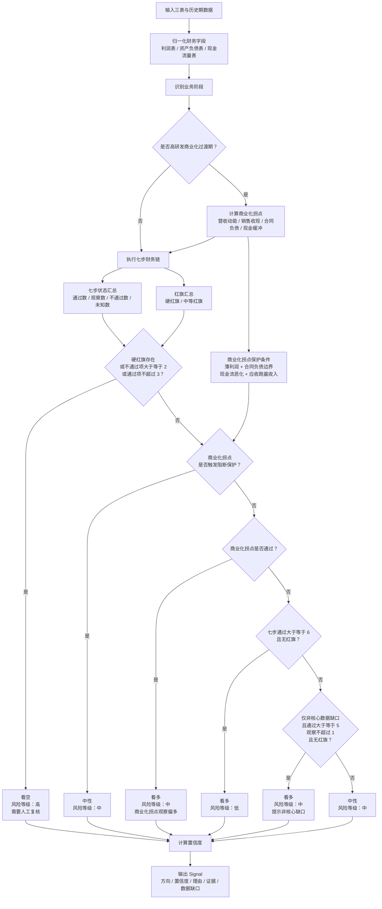
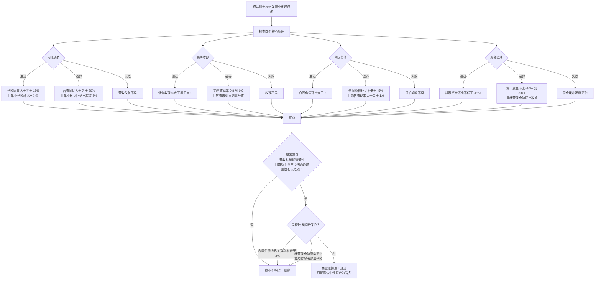

# Financial Report Analysis

## 1. 适用范围

本 Skill 用于把上市公司三张财务报表转化为 AI Renaissance 可消费的财务 Signal。核心目标是判断下一季度净利润同比方向，MVP 指标为 `accuracy@confidence>0.7 >= 70%`。

适用：消费、制造、科技、平台、重资产、医药等非金融企业。地产、建筑、医药必须执行 Step7 行业特殊口径。银行、保险、券商等强金融属性主体暂不适用，默认输出 `direction: neutral` 且 `needs_human_review: true`。

本 Skill 只输出经营质量信号，不输出投资建议，不参与仲裁、仓位、估值或交易判断。

高研发科技公司需先识别业务阶段。半导体 IP、EDA、AI 芯片、创新药、SaaS 等公司如果同时具备高研发投入、营收高增长、合同负债增长、销售收现强、应收未显著跑赢营收等特征，应进入 `rd_commercialization` 口径。该阶段下，亏损和经营现金流为负不自动构成 `high` 红旗，应先判断是否属于研发投入向订单兑现过渡期。

## 2. 输入材料

必填输入：

| 字段 | 要求 |
|---|---|
| `company_name` | 公司名称 |
| `ticker` | 股票代码，可为空但需说明原因 |
| `period` | 报告期，如 `2026Q1` |
| `income_statement` | 利润表核心字段 |
| `balance_sheet` | 资产负债表核心字段 |
| `cash_flow_statement` | 现金流量表核心字段 |
| `source_id` | 数据来源标识，由 `data_sources/` 提供 |
| `base_period` | 同比或环比对照期 |

可选输入：同行对比、公告、研报、产业链数据、历史多期财务数据。

增强输入（有则进入 `meta.additional_checks`，无则必须写入 `meta.data_gaps`，不得假设）：

| 字段 | 用途 |
|---|---|
| `segments` / `product_lines` | 产品线收入占比、同比/环比、毛利率、新产品线斜率 |
| `signed_orders` / `order_backlog` | 已签订单和订单储备，用于验证合同负债是否能兑现 |
| `capacity_expansion_plan` / `capacity_utilization` | 产能扩张计划、产能利用率，验证 capex 和资产扩张质量 |
| `supplier_long_term_agreements` | 供应商长协与保供能力 |
| `top_customer_concentration` / `top_supplier_concentration` | 前几大客户/供应商集中度 |
| `related_party_customer_ratio` / `related_party_supplier_ratio` | 关联方交易占比 |
| `peer_benchmark` | 同行标杆分位数，作为后续迭代计划，不作为当前主评分 |
| `previous_period_data` | 上一报告期三表数据，用于资产负债表环比和利润表/现金流单季拆分 |
| `previous_previous_period_data` | 上上报告期三表数据，用于从累计利润表/现金流量表拆出上一季度单季值 |

缺失处理：

- 三表任一缺失：输出 `direction: neutral`，`confidence <= 0.4`，`needs_human_review: true`。
- 关键字段缺失：对应步骤状态为 `unknown`，不得用行业常识或推测补数。
- 数据口径冲突：优先使用公告原文或数据组封装字段，并在 `meta.evidence` 标记冲突来源。

## 3. 分析步骤

先做 Step0 红色预警扫描，再按七步链顺序分析。详细公式、阈值和行业适配见 `references/`。

| 步骤 | 名称 | 目标 |
|---|---|---|
| Step0 | 红色预警扫描 | 先排除财务重述、收入确认变更、商誉风险、资金占用等硬风险 |
| Step1 | 利润质量 | 判断利润是否被现金支撑 |
| Step2 | 现金流匹配 | 验证销售收现、采购付现与利润表是否匹配 |
| Step3 | 需求真实性 | 用应收、存货、合同负债验证需求是否真实 |
| Step4 | 资本开支 | 判断扩产是否有真金白银投入 |
| Step5 | 债务与利率敏感性 | 检查净债务、短债结构和财务费用侵蚀 |
| Step6 | 扩张质量 | 判断资产扩张是否有订单和产能消化支撑 |
| Step7 | 行业特殊口径 | 按行业调整阈值和特殊会计处理 |

闭环判断：订单真实 -> 现金先回来 -> 应收不恶化 -> 存货/在建抬升 -> 资本开支放量 -> 债务可承受 -> 行业口径可解释。

增强检查不改变顶层 `Signal` 字段，但必须进入 `meta.additional_checks`：

- 往来账质量：预付款、其他应收、其他应付、存货是否显著跑赢收入/合同负债。
- capex 与产能验证：capex、固定资产、在建工程、无形资产、非流动资产增速与收入、合同负债、预付款是否同向。
- 前瞻订单与产能：先用合同负债和销售收现作为代理指标；缺已签订单、订单储备、产能扩张计划、供应商长协时写入 `data_gaps`。
- segment/product line：缺产品线收入占比、增速、毛利率、合同资产/预收等结构化数据时写入 `data_gaps`。
- 客户供应商：缺前五大客户/供应商、关联方交易占比时写入 `data_gaps`。
- 同行标杆：当前仅写入 `iteration_plan`，后续接入可比公司池和指标分位数后再参与评分。
- 环比趋势：资产负债表时点项目直接用当前报告期末对上一报告期末；利润表和现金流量表必须先用累计数拆单季，再计算营收、研发费用、毛利率、经营现金流环比。若缺少当前期、上一报告期或上上报告期累计数，写入 `data_gaps.sequential_trend`，不得用累计数直接硬算。
- 指标释义：`meta.evidence[]` 必须带 `metric_label` 和 `metric_meaning`；`meta.additional_checks.*.metric_labels` 必须给出该检查项涉及指标的中文名和财务含义，方便 OrchestratorAgent 直接展示给非财务用户。

## 4. 判断规则

`direction` 由七步状态和红色预警共同决定：

| 条件 | 输出 |
|---|---|
| 七步全部通过且 Step0 无红色预警 | `bullish`，通常 `risk_level: low` |
| 高研发商业化过渡期，营收、销售收现、合同负债和现金缓冲共同满足商业化拐点条件，且无硬红旗 | `bullish`，但 `risk_level: medium` |
| 七步通过 5 项以上且核心预警不超过 2 项 | `neutral` 或弱 `bullish` |
| 七步通过不超过 3 项，或触发财务重述/收入确认变更/商誉重大减值风险 | `bearish`，`risk_level: high`，`needs_human_review: true` |
| 关键数据不足 | `neutral`，`confidence <= 0.4`，`needs_human_review: true` |

### 财务方向判断流程



### 高研发商业化拐点流程



高研发商业化过渡期的“商业化拐点观察偏多”必须同时满足：

- 营收改善是核心条件：营收同比增速大于等于 15%，且单季营收环比不为负；若营收同比增速大于等于 30% 但单季环比小幅回落不超过 5%，只能作为边界观察，不能单独触发偏多。
- 销售收现达标：销售收现率大于等于 0.9；若在 0.8 到 0.9 之间，必须同时满足应收账款未明显跑赢营收，才可作为边界观察。
- 合同负债环比改善：合同负债环比大于 0；若合同负债环比小幅回落不超过 5%，必须同时满足销售收现率大于等于 1.0，才可作为边界观察。
- 现金缓冲未明显恶化：货币资金环比不低于 -20%；若货币资金环比在 -30% 到 -20% 之间，必须同时满足经营现金流环比改善，才可作为边界观察。
- 四项中至少三项明确通过，且四项均不得失败；该规则只把“仍亏损但商业化证据已经改善”的样本从默认中性提升为观察偏多，不取消阶段性风险提示。
- 保护条件：若合同负债只处于边界观察且净利率低于 3%，不得提升为观察偏多；若经营现金流真实恶化，或应收账款同比增速显著跑赢营收同比增速，也不得提升为观察偏多。经营现金流真实恶化指单季经营现金流由正转负，或在已经为负时流出额继续明显扩大；单季经营现金流由负转正不属于恶化。
- 折旧摊销、产能利用率、订单原文、客户供应商结构等非核心增强数据缺失时，应写入 `meta.data_gaps` 并小幅降低 `confidence` 或在 `reasoning` 中提示；不得仅因这些次要指标缺失直接改变 `direction`。只有当这些指标已经存在且触发明确风险时，才可作为风险证据参与判断。

红旗项必须分层：

- 硬红旗：财务重述、收入确认重大变化、审计意见异常、资金占用、商誉重大减值、现金流断裂、短债压力明显大于现金安全垫等，保持 `high`。
- 阶段性红旗：高研发商业化过渡期的亏损、经营现金流为负、营业利润为负且财务费用为正，默认标为 `medium/watch`，除非收入、合同负债、收现、应收和现金安全垫同步恶化。
- 科技公司专用红旗：研发费用率高但收入无增长、研发费用增长显著快于收入增长、合同负债增长但收现未跟上、应收显著跑赢营收、毛利率恶化、经营现金流持续为负且现金安全垫不足。

`confidence` 必须按 `references/confidence_rules.md` 从 evidence 数量、独立性、一致性、数据可靠性、跨期确认反推，不允许凭直觉填写。最终 confidence 取「结论支持强度」与「证据强度反推值」的较低者。

结论支持强度不是简单按 `pass_count` 加分，而是判断七步状态是否支持当前 `direction`：

- `bullish`：`pass` 是强支持，`fail` 是反证。
- `bearish`：`fail` 是强支持，`pass` 是反证。
- `neutral`：`pass` 和 `watch` 都可以构成支持，因为中性结论通常来自“部分链条成立、部分链条需要观察”；`unknown` 只给低支持。
- 因此，一个证据闭环清楚的 `neutral` 也可以超过 `0.7`，表示“中性判断可信”，不是表示“看多”。

同比和环比必须作为两条独立证据链进入 confidence：

- 同比和环比同向验证收入兑现、订单前瞻、应收受控或资产扩张时，可以提高对当前结论的置信度。
- 同比和环比同向验证预付款、其他应收、存货等风险时，也可以提高对风险判断的置信度，但不应直接提高 `direction`。
- 同比和环比方向冲突时，应降低趋势确认分或保持中性，不得只按同比给高置信。
- 利润表/现金流环比必须优先用单季口径；若数据源只给累计口径，则按 `Q1=Q1累计`、`Q2=H1-Q1`、`Q3=Q3累计-H1`、`Q4=年报-Q3累计` 拆分。缺少拆分所需报告期时，必须写入 `data_gaps.sequential_trend`，不得用累计数直接计算。

## 5. 标准输出

只输出 Signal JSON，不输出 Markdown 报告。顶层字段应与 `agents.signal.Signal` 对齐，证据放入 `meta`。

```json
{
  "direction": "neutral",
  "confidence": 0.62,
  "reasoning": "利润增长有现金支撑，但合同负债下滑，未来需求真实性需继续验证。",
  "signals": ["现金利润比达标", "合同负债增速弱于营收"],
  "source": "financial-report-analysis",
  "signal_type": "financial",
  "stock_code": "SZ000000",
  "weight": 1.0,
  "meta": {
    "output_version": "0.1",
    "skill_name": "financial-report-analysis",
    "owner_group": "专家1组（财务）",
    "target": "SZ000000",
    "period": "2026Q1",
    "time_horizon": "short",
    "risk_level": "medium",
    "company_name": "样例公司",
    "step_results": {},
    "red_flags": [],
    "key_findings": [],
    "business_stage": {},
    "commercial_inflection": {},
    "additional_checks": {},
    "evidence": [],
    "data_gaps": [],
    "iteration_plan": [],
    "risk_notes": [],
    "uncertainties": [],
    "needs_human_review": false
  }
}
```

## 6. 质量检查

提交前必须回答三问：

1. 数据从哪来：每个关键数字是否有 `source_type/source_name/date/metric/value/comparison`。
2. 结论怎么来：每个方向判断是否能追溯到七步链步骤和阈值。
3. 系统能不能用：输出是否为可解析 JSON，顶层字段是否与 `agents.signal.Signal` 对齐，缺失数据是否降置信并在 `meta.needs_human_review` 触发人工复核。

自检清单：

- frontmatter 含 `name/description/owner_group/domain/status`。
- 6 节结构齐全。
- 不输出投资建议。
- `confidence` 来源于证据强度反推。
- 二手来源不作为核心证据，除非有官方来源交叉验证。
- 字段映射与 `data_sources/` 责任边界分离，未确认字段保留 TODO。
